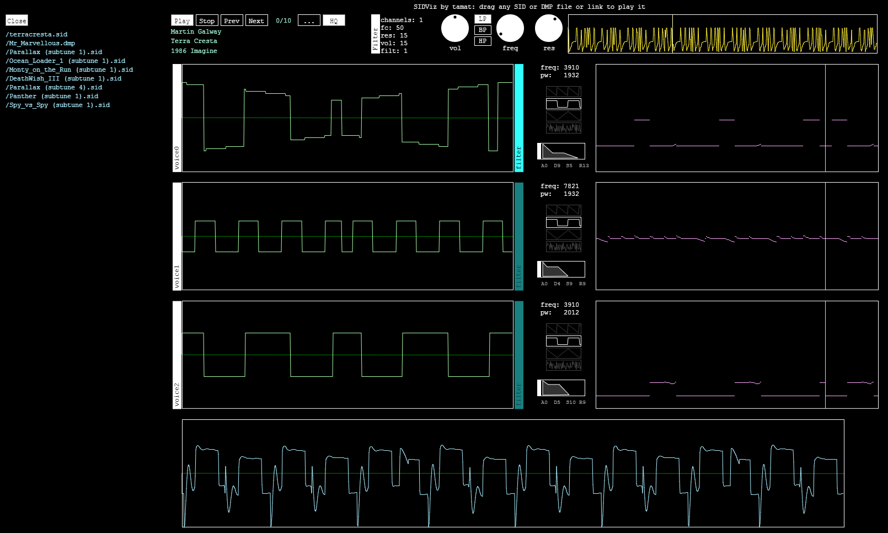

# sidviz
A C64 Music chip 6581/8580 visualizer in javascript. It allows to playback SID files and shows the state of the chip during the playback.

Demo can be found here: http://tamats.com/apps/sid
